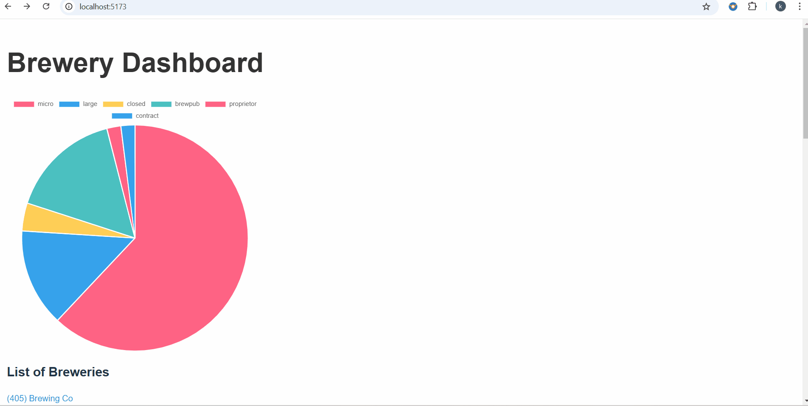

# Project 5 - *Data Dashboard Part 2*

Submitted by: **Keerthi Kalyan Botu**

## Required Features

The following **required** functionality is completed:

* [x] Add Data Visualizations
  The app includes at least one unique chart developed using the fetched data that tell an interesting story.

* [x] Add Links to Detail View
 Clicking on an item in the list view displays more details about it.
  Each detail view of an item has a direct, unique link to that item’s detail view pagecified categories

## Notes

In the video walkthrough, both sample website and localhost website are shown.

## Video Walkthrough

Here's a walkthrough of implemented features:

<!-- Replace this with whatever GIF tool you used! -->
GIF created with ...  
<!-- Recommended tools:
[Kap](https://getkap.co/) for macOS
[ScreenToGif](https://www.screentogif.com/) for Windows
[peek](https://github.com/phw/peek) for Linux. -->

## License

    Copyright [2025] [Keerthi Kalyan Botu]

    Licensed under the Apache License, Version 2.0 (the "License");
    you may not use this file except in compliance with the License.
    You may obtain a copy of the License at

        http://www.apache.org/licenses/LICENSE-2.0

    Unless required by applicable law or agreed to in writing, software
    distributed under the License is distributed on an "AS IS" BASIS,
    WITHOUT WARRANTIES OR CONDITIONS OF ANY KIND, either express or implied.
    See the License for the specific language governing permissions and
    limitations under the License.